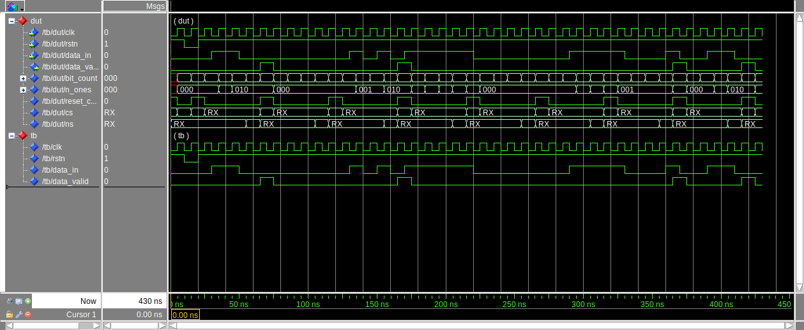

## Exercise

Five-bit sequences of bits (a "nibble") are being received one bit at a time
and you are to determine if these nibbles are valid. Each nibble represents a
decimal number encoded in a format called "2-of-5". The format is called this
because each nibble has only two 1s in it (see table). These are the only
valid nibbles. From reset, begin receiving the bits (the right-hand bit of the
nibble arrives first). When the fifth bit is on the input, assert the valid
output if is one of the 2-of-5 nibbles; don't assert valid if it is not. The
next bit on the input will be the first bit of the next nibble (i.e. input
nibbles just keep coming). The valid output is asserted only when the correct
last input is on the input.

| 2-of-5 |
| ------ |
| 00011  |
| 00101  |
| 00110  |
| 01010  |
| 01100  |
| 01001  |
| 11000  |
| 10100  |
| 10010  |
| 10001  |

In your design, use a counter to keep track of the bit number within the
nibble and another counter to keep track of how many ones have been seen in the
current nibble.

Draw the state transition diagram for the system. Identify the control and
status points. Write and test the module. Compare this to a design where there
is no datapath - only an FSM to encode the whole system.

## Solution

