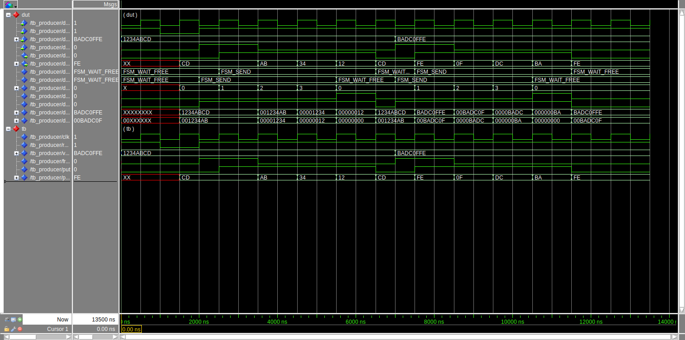
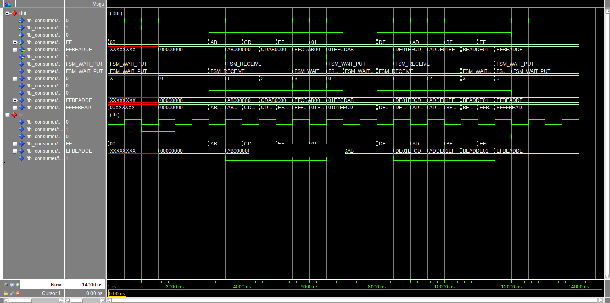
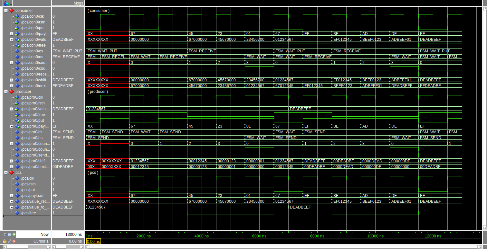

## Exercise

A producer sends 32-bits of information to a consumer serially in four 8-bit
chunks. The consumer receives the information, putting it into a 32-bit word
for its output. See the diagram

```
                +-----------+    put    +-----------+                 
                |           |---------->|           |                 
                |           |           |           |                 
 value_to_send  | Producer  |   free    | Consumer  | value_received  
------/32------>| Interface |<----------| Interface |-------/32------>
                |           |           |           |                 
                |           |  payload  |           |                 
                |           |----/8---->|           |                 
                +-----------+           +-----------+                 
```

The transfer is controlled by signaling variables (**put** and **free**). The data
is transmitted on **payload**. There are separate FSMs in the producer and
consumer driving these signals. The timing diagram shown below explains how
data is transferred from producer to consumer. This is all synchronous timing.
When the consumer is ready to receive information it asserts **free**. The
producer FSM, seeing **free**, puts the **pay.a** data byte on the **payload** lines
and asserts **put** at the same time. The consumer FSM, seeing **put** asserted
does two things: it de-asserts **free** (because its no longer free, it's
receiving data), and loads the data from **payload** into bit variables **pay.a**
through **pay.d** on the next clock edges. Following the state where **pay.d** was
on the line, **put** is unasserted. The consumer seeing that **put** is
not-asserted, reasserts **free** in the next state. 


<details>
<summary>

#### How the timing diagram has been generated?

</summary>

With [Wavedrom](https://wavedrom.com/) using the following code

```
{signal: [
  {name: 'clk',     wave: 'p........'},
  {name: 'payload', wave: 'x.3333x..', data: ['pay.a', 'pay.b', 'pay.c', 'pay.d']},
  {name: 'put',     wave: '0.1...0..'},
  {name: 'free',    wave: '01.0.....'}
]}
```

and embed it like so in the Markdown file

```markdown

```

</details>

## Solution

The two modules has been implemented separately. Each `.vhdl` file inside the
folder `src` comprehend the implementation and the testbench of the
corresponding module.

The results of each are shown below.

### Producer Testbench



### Consumer Testbench



### Producer-Consumer Testbench



