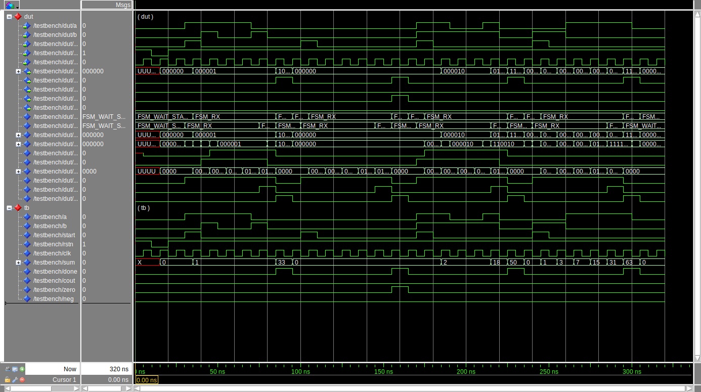

## Exercise
Design a serial adder defined by the following module header and timing
diagram. Your serial adder should add two 6-bit numbers; each number arrives
one bit at a time, least significant bit first. Instantiate the necessary
modules (full-adder, flip-flops, registers, plus FSM, etc), connect them
together and demonstrate with a testbench.

**a** and **b** are the bits to be added. **start** indicates when the first
least significant bits are on the inputs. Note that the sum is captured in an
internal sum register, and **done** indicates that the final 6-bit sum is
available on the **sum** output. It also indicates that the other output
signals (out, zero, ...) are valid. All the input and output signals are
asserted for one clock time.

Note that the first two bits of **a** and **b** are summed into the first bit
of the sum register (1st sum). At the next clock tick, the next bit of each of
**a** and **b** are summed along with any carry out from the previous sum
producing the second bit of the sum register (2nd sum). This continues until
all 6 bits are summed and in an internal register (sum). The done signal
indicates that the sum is complete and the output is valid. 

The port definition is the following

```vhdl
entity serial_adder is
    port (
        a               : in    std_logic;
        b               : in    std_logic;
        start           : in    std_logic;
        reset           : in    std_logic;
        clk             : in    std_logic;
        sum             : out   std_logic_vector(5 downto 0);
        done            : out   std_logic;
        cout            : out   std_logic;
        zero            : out   std_logic;
        neg             : out   std_logic
        );
end entity serial_adder;
```


<details>
<summary>

#### How the timing diagram has been generated?

</summary>

With [Wavedrom](https://wavedrom.com) using the following code

```
{signal:
    [
        {name: 'clk',               wave: 'p.........'},
        {name: 'a',                 wave: 'x======x..'},
        {name: 'b',                 wave: 'x======x..'},
        {name: 'start',             wave: '010.......'},
        {name: 'sum',               wave: 'xx=======.', data: ['sum1', 'sum2', 'sum3', 'sum4', 'sum5', 'sum6']},
        {name: 'done',              wave: '0......10.'},
        {name: 'cout, zero, neg',   wave: '0......10.'}
    ]
}
```
Embedded inside markdown like so

```

```
</details>

### Solution

The solution presents the following wave



There is also a batch simulation to check that all the sums are correct. If
all sums are computed correctly then the following output is shown

```
$ make batch
vsim -c -do "run -all" -suppress GroupWarning -quiet work.TESTBENCH
Reading pref.tcl

# 2020.1

# vsim -c -do "run -all" -suppress GroupWarning -quiet work.TESTBENCH
# Start time: 12:45:34 on Feb 13,2025
# run -all
# End time: 12:45:34 on Feb 13,2025, Elapsed time: 0:00:00
# Errors: 0, Warnings: 0
```
otherwise errors message will inform that sums are incorrect
```
$ make batch
vsim -c -do "run -all" -suppress GroupWarning -quiet work.TESTBENCH
Reading pref.tcl

# 2020.1

# vsim -c -do "run -all" -suppress GroupWarning -quiet work.TESTBENCH
# Start time: 12:46:41 on Feb 13,2025
# run -all
# ** Error: Summing 15 + 18. Expected 33, got 16
#    Time: 90 ns  Iteration: 0  Instance: /testbench
# ** Error: Summing 19 + 31. Expected 50, got 24
#    Time: 230 ns  Iteration: 0  Instance: /testbench
# ** Error: Summing 60 + 3. Expected 63, got 31
#    Time: 300 ns  Iteration: 0  Instance: /testbench
# End time: 12:46:41 on Feb 13,2025, Elapsed time: 0:00:00
# Errors: 3, Warnings: 0
```
