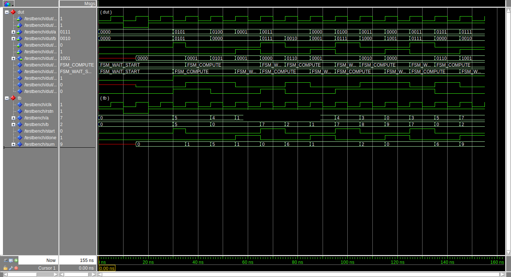

## Exercise

Originally, simple calculators performed calculations without converting
numbers, entered in binary coded decimal (BCD), to binary. Instead, the
calculations were done BCD-digit serially. This also meant that you didn't need
to convert back from binary to BCD for display. Down deep inside the calculator
was a serial BCD adder.

Design a serial BCD adder meeting the following module header. The first two
BCD digits (least significant) will be on the input when "start" is asserted.
"done" indicates that the current BCD inputs are the last. The next "start" signal
could be at the next clock tick after done appears. The output always has the
BCD sum of the two current inputs plus any carry from a previous stage (there
is no carry into the first stage). Remember, the only valid BCD digits on
inputs and output are 0-9. 

```vhdl
entity serial_bcd_adder is
    port (
        clk     : in    std_logic;
        rstn    : in    std_logic;
        a       : in    std_logic_vector(3 downto 0);
        b       : in    std_logic_vector(3 downto 0);
        start   : in    std_logic;
        done    : in    std_logic;
        sum     : out   std_logic_vector(3 downto 0)
    );
end entity serial_bcd_adder;
```


<details>
<summary>

#### How the timing diagram has been generated?

</summary>

With [Wavedrom](https://wavedrom.com/) using the following code
```
{ signal:
    [
        {name: 'clk',   wave: 'p.....'},
        {name: 'start', wave: '010.10'},
        {name: 'a',     wave: 'x===x.', data: ['1', '2', '3']},
        {name: 'b',     wave: 'x===x.', data: ['4', '8', '0']},
        {name: 'sum',   wave: 'x===x.', data: ['5', '0', '4']},
        {name: 'done',  wave: '0..10.'},
    ]
}
```
and embed it in the Markdown file

```markdown

```
</details>

### Solution

The simulation can be done via GUI (`make sim`) or batch (`make batch`). The
former gives the following waveform



while the latter output
```
$ make batch
vsim -c -do "run -all" -suppress GroupWarning -quiet work.TESTBENCH
Reading pref.tcl

# 2020.1

# vsim -c -do "run -all" -suppress GroupWarning -quiet work.TESTBENCH
# Start time: 14:53:12 on Feb 14,2025
# run -all
# ** Note: Sending 1455 + 55 expect 1510
#    Time: 30 ns  Iteration: 0  Instance: /testbench
# ** Note: Sending 33 + 127 expect 160
#    Time: 65 ns  Iteration: 0  Instance: /testbench
# ** Note: Sending 34 + 987 expect 1021
#    Time: 95 ns  Iteration: 0  Instance: /testbench
# ** Note: Sending 753 + 207 expect 960
#    Time: 125 ns  Iteration: 0  Instance: /testbench
# ** Note: Test finished
#    Time: 155 ns  Iteration: 0  Instance: /testbench
# End time: 14:53:12 on Feb 14,2025, Elapsed time: 0:00:00
# Errors: 0, Warnings: 0
```
