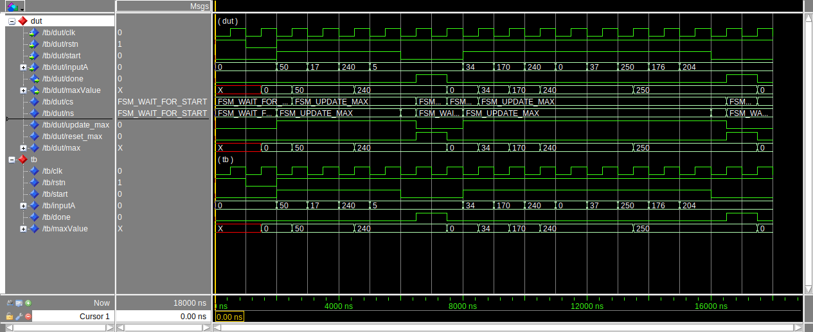

## Exercise

Design and implement a hardware thread to find the maximum unsigned number on
its input. The thread port definition is

```vhdl
entity max is
    port(
        clk:        in  std_logic;
        rstn:       in  std_logic;
        start:      in  std_logic;
        inputA:     in  std_logic_vector(7 downto 0);
        done:       out std_logic;
        maxValue:   out std_logic_vector(7 downto 0)
        );
end max;
```

**start** is the control signal, telling the thread when to start receiving
inputs. The FSM-D will wait until the **start** signal is asserted before
processing. When it is first asserted, the first **inputA** value is on the
input. While **start** remains asserted, there will be new input values on
**inputA** at each successive clock edge. As each of these inputs is available,
**maxValue** is updated so that it is always the maximum of the prior inputs.

When **start** becomes not-asserted, **done** is asserted, indicating that the
**maxValue** output has the maximum value of the sequence of inputs; it remains
asserted for one clock edge. The system then waits for the next **start** to be
asserted. On reset, **maxValue** should be 0 and the system is waiting for
**start**. There could be more/less than four inputs in the sequence.

### Solution


